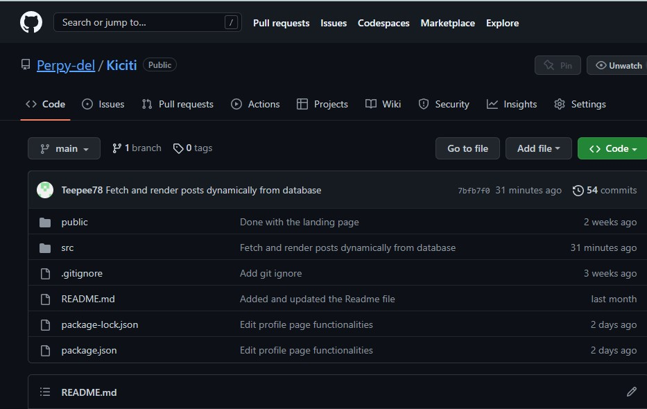
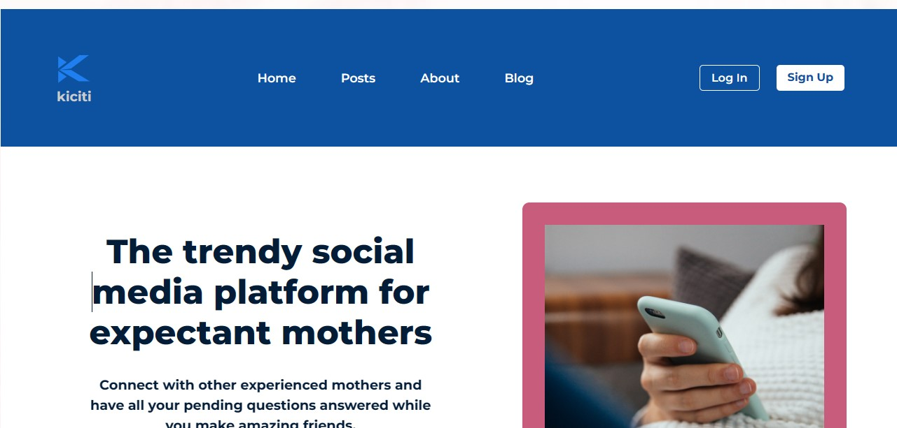

# KICITI - *The MUMMY's World*


# Introduction

## The Project
Most expectant mothers do not know what to expect throughout their pregnancy journey. Kiciti is a social media platform that connects expectant mothers together in a community where they can share helpful tips with each other and also gain more knowledge regarding pregnancy.

## The Team
We are two first children of our parents who have heard stories from our mothers about how challenging the pregnancy to delivery process can be. This inspired us to work on this project. Meet mummy's babies:
-  Toluwalase Phillips [@Teepee78](https://github.com/Teepee78)
-  Perpetual Meninwa [@Perpy-del](https://github.com/Perpy-del)

Follow us on github for more tech related gists...

#### Dependencies/Tools
The dependencies and tools used include:
- React

React is a javascript library for building user interfaces. It is declarative and component based making it so much easier to build interfaces from the frontend
** Installing React--
[Create React App](https://github.com/facebook/create-react-app).

Ensure that node and npm is installed first. From your terminal:

```bash
node -v
```

```bash
npm -v
```

Installing node and npm:

```bash
$ nvm use 16
Now using node v16.9.1 (npm v7.21.1)
$ node -v
v16.9.1
$ nvm use 14
Now using node v14.18.0 (npm v6.14.15)
$ node -v
v14.18.0
$ nvm install 12
Now using node v12.22.6 (npm v6.14.5)
$ node -v
v12.22.6
```

Then install react using the same terminal:

```bash
npx create-react-app lendsqr
```

lensqr being the name of the app in this case.

Then:

```bash
npm start
```

Runs the app in the development mode.\
Open [http://localhost:3000](http://localhost:3000) to view it in your browser.

- React Router Dom

React router helps with routing between pages in your browser.

Installing react-router-dom:

```bash
npm i react-router-dom
```

- Accessing Kiciti Project from GitHub

On your browser,

```bash
https://github.com/Perpy-del/Kiciti
```

- Accessing Kiciti Project on GitHub 

Access GitHub on any browser
Copy and paste this
```bash
git clone https://github.com/Perpy-del/Kiciti.git
```



# Tutorial

Here is our live demo. Please take a tour of the deployed site... 

==>> [Kiciti](https://kiciti.netlify.app/)

Here is a little preview of the site...


# License
MIT

Thank you for reading. Enjoy~
